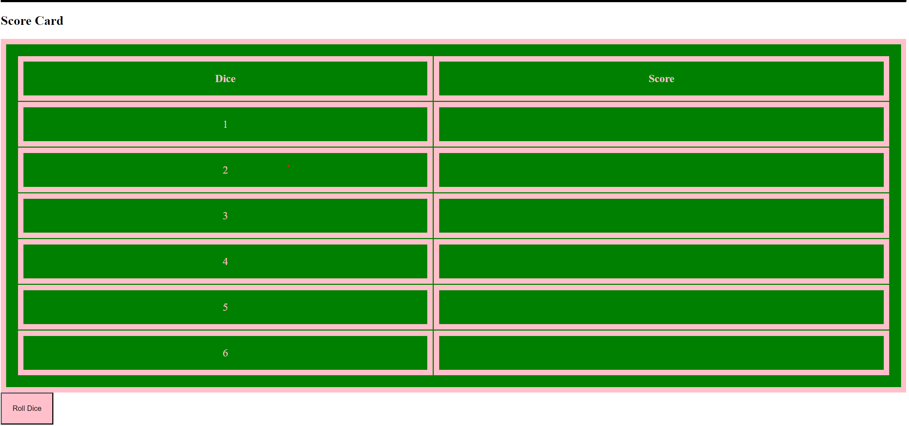

## **Introduction**
This document outline the design and style guide for my Yatzy game project.

## **Game Overview**
Yatzy is a popular dice game that require a combination of luck and strategy. In this game, the player roll a dice in a total of 13 rounds, and the goal is to score as many point as possible,

## **Design System**
Color Palette
- Primary Color: #-FFC0CB for text, and table boarder
- Secondary Color: #0080000- Used for background of the table.
- Tertiary Color: #-0000000 Used for header background, and the second header text.
Typography
- **Body Text:** `"Arial", Helvetica, sans-serif`
- **Headers:** `'Arials', Helvetica, sans-serif`
Game Mock-ups

Playing Instructions
- Game start: Each players rolls a die;
- Rolling the dice: Player can roll up to 3 time each round;
- Scoring: Points are award based on the dice combination rolled.
- Game End: One player roll 13 rounds of dice, all scorecard combinations are filled, tally the point. The player with the highest score wins!
## **Conclusion**
This design document serve as a foundation for my Yatzy game development.